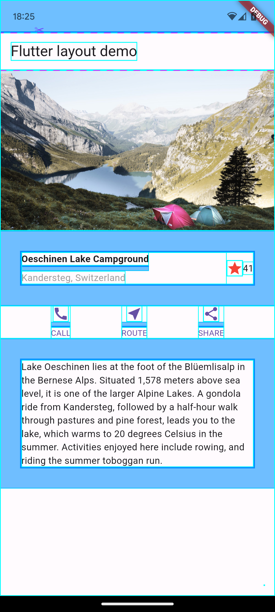

# flutter_tutorial

Flutter公式ドキュメントの[Building layouts | Flutter](https://docs.flutter.dev/ui/layout/tutorial#step-5-implement-the-image-section)を実装したチュートリアルです。

※ガイドラインは[Flutter inspector](https://docs.flutter.dev/tools/devtools/inspector)の中の[Show guidelines](https://docs.flutter.dev/tools/devtools/inspector#show-guidelines)から表示を切り替えることができます。オン/オフを切り替えられるので必要な時のみ表示するのが良いと思います。

| 完成形 | （参考）ガイドライン付き |
| --- | --- |
|  |  |
